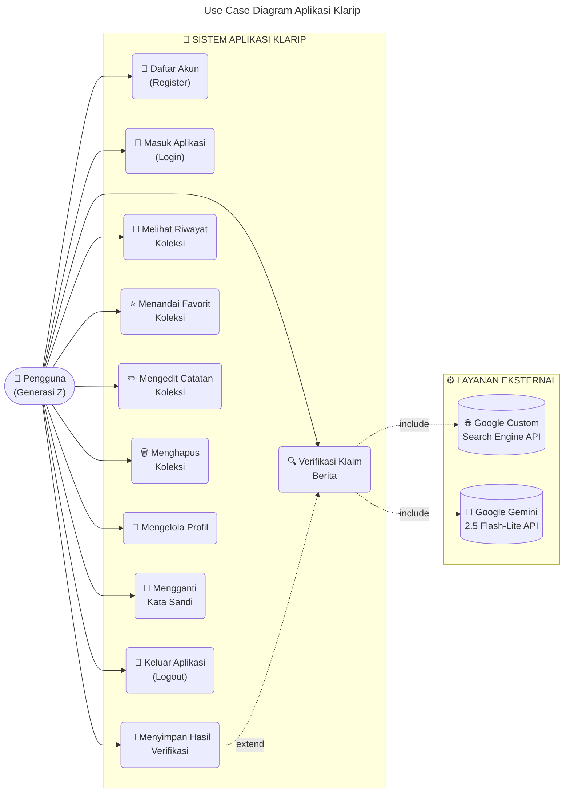
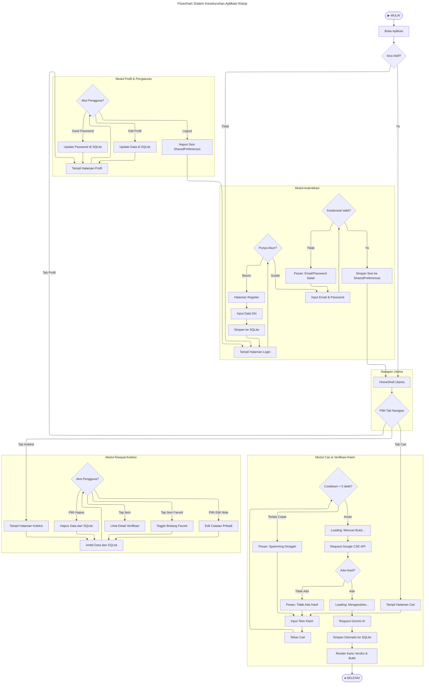
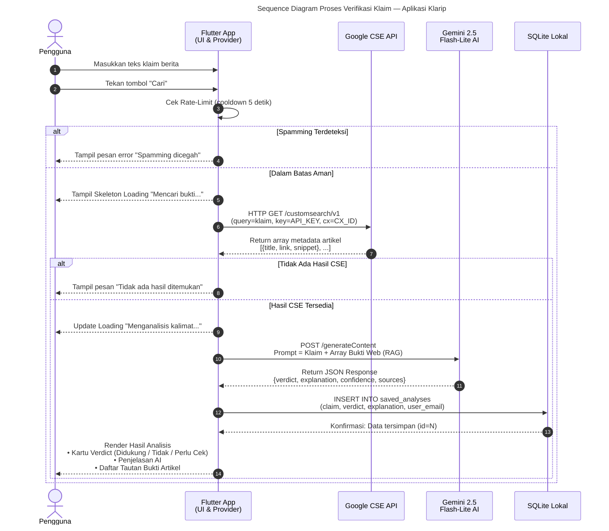

# Diagram Mermaid — Perancangan Alur Kerja Sistem Klarip (Revisi)
## Untuk BAB 4 Sub-bab 2b: Perancangan Alur Kerja Sistem

---

## DIAGRAM 1 — Use Case Diagram

> Salin kode di bawah ini ke: https://mermaid.live

---

## DIAGRAM 2 — Flowchart Sistem (Alur Keseluruhan Aplikasi)

> **Catatan Revisi:** Flowchart ini telah dirapikan menggunakan blok `subgraph` agar alurnya tersusun lurus dari atas ke bawah (Top-Down) per modul, sehingga tidak terlihat berantakan atau bertabrakan garisnya.
> Salin kode di bawah ini ke: https://mermaid.live

---

## DIAGRAM 3 — Sequence Diagram (Khusus Alur Verifikasi Klaim)

> Sequence Diagram ini HANYA menampilkan alur proses komputasi CSE dan AI yang berjalan di balik layar saat memverifikasi klaim. Salin kode di bawah ini ke: https://mermaid.live

---

## DIAGRAM 4 — Sequence Diagram (Khusus Operasi CRUD Koleksi)

> Diagram ini adalah **tambahan** untuk memperlihatkan bagaimana interaksi aplikasi dengan Database SQLite untuk memuat, mengedit, memfavoritkan, dan menghapus riwayat analisis (CRUD). Salin kode di bawah ini ke: https://mermaid.live

```mermaid
---
title: Sequence Diagram Operasi CRUD Riwayat Koleksi (Saved Analyses)
---
sequenceDiagram
    autonumber
    actor PG as Pengguna
    participant UI as Halaman Koleksi<br/>(Flutter UI)
    participant PROV as SavedAnalysisProvider
    participant DB as DatabaseHelper<br/>(SQLite)

    %% Skenario READ (Load Data)
    rect rgb(30, 40, 50)
    Note over PG,DB: 1. SKENARIO READ (Memuat Daftar Koleksi)
    PG->>UI: Buka Tab Koleksi
    UI->>PROV: Panggil loadAnalyses()
    PROV->>DB: queryAll('saved_analyses', where user_email)
    DB-->>PROV: Return List of Maps (Data Koleksi)
    PROV->>PROV: Sortir data (Favorit di atas, Terbaru di atas)
    PROV-->>UI: notifyListeners() (Update List)
    UI-->>PG: Tampilkan daftar riwayat analisis
    end

    %% Skenario UPDATE FAVORITE
    rect rgb(30, 50, 40)
    Note over PG,DB: 2. SKENARIO UPDATE (Toggle Favorit)
    PG->>UI: Tekan Ikon Bintang (Favorit) pada Item A
    UI->>PROV: Panggil toggleFavorite(id)
    PROV->>PROV: Update State Lokal secara Optimis (Ubah Icon)
    PROV-->>UI: notifyListeners() (Render Bintang Penuh)
    PROV->>DB: update('saved_analyses', is_favorite = 1, where id)
    DB-->>PROV: Konfirmasi baris di-update
    end

    %% Skenario UPDATE NOTE
    rect rgb(50, 40, 30)
    Note over PG,DB: 3. SKENARIO UPDATE (Edit Catatan Pribadi)
    PG->>UI: Pilih Menu "Edit Catatan", Masukkan teks
    PG->>UI: Tekan "Simpan"
    UI->>PROV: Panggil updateNote(id, "Teks baru")
    PROV->>DB: update('saved_analyses', user_note = "Teks baru", where id)
    DB-->>PROV: Konfirmasi baris di-update
    PROV->>PROV: Perbarui State Lokal
    PROV-->>UI: notifyListeners() (Update Teks UI)
    UI-->>PG: Tampilkan pesan "Catatan berhasil diperbarui"
    end

    %% Skenario DELETE
    rect rgb(50, 30, 30)
    Note over PG,DB: 4. SKENARIO DELETE (Hapus Koleksi)
    PG->>UI: Pilih Menu "Hapus" pada Item A
    UI-->>PG: Tampil Dialog Konfirmasi Hapus
    PG->>UI: Tekan "Ya, Hapus"
    UI->>PROV: Panggil deleteAnalysis(id)
    PROV->>DB: delete('saved_analyses', where id)
    DB-->>PROV: Konfirmasi baris dihapus
    PROV->>PROV: Hapus Item A dari State Lokal
    PROV-->>UI: notifyListeners() (Hilangkan Item dari UI)
    UI-->>PG: Tampilkan pesan "Analisis dihapus"
    end
```

---

## DIAGRAM 5 — Sequence Diagram (Khusus Operasi CRUD Data Pengguna)

> Diagram ini memperlihatkan interaksi **Modul Autentikasi dan Profil** dengan Database SQLite untuk memproses pendaftaran (Create), login (Read), dan pembaruan data pengguna/kata sandi (Update). Salin kode di bawah ini ke: https://mermaid.live

```mermaid
---
title: Sequence Diagram Operasi CRUD Data Pengguna (Auth & Profil)
---
sequenceDiagram
    autonumber
    actor PG as Pengguna
    participant UI as Flutter UI<br/>(Auth/Profil)
    participant PROV as AuthProvider
    participant DB as DatabaseHelper<br/>(SQLite)

    %% Skenario REGISTER (Create)
    rect rgb(30, 40, 50)
    Note over PG,DB: 1. SKENARIO CREATE (Register Akun Baru)
    PG->>UI: Input Nama, Username, Email, Password
    PG->>UI: Tekan "Daftar"
    UI->>PROV: Panggil register(...)
    PROV->>DB: getUserByEmail(email)
    
    alt Email Sudah Ada
        DB-->>PROV: Return User Data
        PROV-->>UI: Return Error "Email sudah terdaftar"
        UI-->>PG: Tampil Snackbar Error
    else Email Belum Ada
        DB-->>PROV: Return null
        PROV->>DB: insert('users', newUserMap)
        DB-->>PROV: Konfirmasi (id=N)
        PROV->>PROV: Auto Login via SharedPreferences
        PROV-->>UI: Return Success
        UI-->>PG: Pindah ke Halaman Home
    end
    end

    %% Skenario LOGIN (Read Session)
    rect rgb(30, 50, 40)
    Note over PG,DB: 2. SKENARIO READ (Login & Sesi Aktif)
    PG->>UI: Input Email & Password
    PG->>UI: Tekan "Masuk"
    UI->>PROV: Panggil login(email, password)
    PROV->>DB: query('users', where email & password)
    
    alt Kredensial Salah
        DB-->>PROV: Return null
        PROV-->>UI: Return Error "Email/password salah"
        UI-->>PG: Tampil Pesan Error
    else Kredensial Benar
        DB-->>PROV: Return User Data
        PROV->>PROV: Simpan Email ke SharedPreferences
        PROV->>PROV: Set State _currentUser
        PROV-->>UI: Return Success
        UI-->>PG: Pindah ke Halaman Home
    end
    end

    %% Skenario UPDATE PROFIL
    rect rgb(50, 40, 30)
    Note over PG,DB: 3. SKENARIO UPDATE (Edit Profil)
    PG->>UI: Ubah Nama atau Username
    PG->>UI: Tekan "Simpan Perubahan"
    UI->>PROV: Panggil updateProfile(updatedUser)
    PROV->>DB: update('users', updatedMap, where id)
    DB-->>PROV: Konfirmasi baris di-update
    PROV->>PROV: Perbarui State _currentUser
    PROV-->>UI: notifyListeners()
    UI-->>PG: Tampil Pesan "Profil diperbarui"
    end

    %% Skenario UPDATE PASSWORD
    rect rgb(50, 30, 30)
    Note over PG,DB: 4. SKENARIO UPDATE (Ganti Kata Sandi)
    PG->>UI: Input Password Lama & Baru
    PG->>UI: Tekan "Ganti Password"
    UI->>PROV: Panggil changePassword(id, old, new)
    
    alt Password Lama Salah
        PROV-->>UI: Return Error "Password lama salah"
    else Password Lama Benar
        PROV->>DB: update('users', password=new, where id)
        DB-->>PROV: Konfirmasi baris di-update
        PROV->>PROV: Perbarui State Lokal
        PROV-->>UI: Return Success
        UI-->>PG: Tampil Pesan "Password berhasil diganti"
    end
    end

    %% Skenario LOGOUT (Hapus Sesi)
    rect rgba(100, 100, 100, 1)
    Note over PG,DB: 5. SKENARIO LOGOUT (Keluar Sesi)
    PG->>UI: Tekan "Logout"
    UI->>PROV: Panggil logout()
    PROV->>PROV: Hapus 'user_email' dari SharedPreferences
    PROV->>PROV: Set State _currentUser = null
    PROV-->>UI: notifyListeners()
    UI-->>PG: Pindah ke Halaman Login
    end
```

