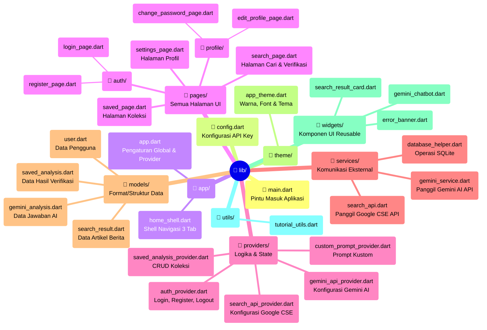

# BAB 4 — TAHAP IMPLEMENTASI
## (Untuk Disalin ke Dokumen Skripsi Microsoft Word)

---

## Penjelasan Struktur Folder `lib/` (Direktori Utama Kode Program)

Sebelum masuk ke penjelasan implementasi, penting untuk memahami terlebih dahulu bagaimana kode program aplikasi Klarip diorganisir. Seluruh kode program inti aplikasi berada di dalam folder `lib/`, yang terbagi menjadi beberapa sub-folder dengan tugas masing-masing. Struktur lengkap folder `lib/` dapat dilihat pada diagram berikut:



Berikut adalah penjelasan singkat fungsi setiap folder dalam tabel:

| Folder / File | Fungsi |
|---|---|
| `lib/main.dart` | Pintu masuk utama aplikasi. File pertama yang dijalankan saat aplikasi dibuka. |
| `lib/config.dart` | Berisi kunci API (*API Key*) bawaan untuk Google CSE dan Gemini AI. |
| `lib/app/` | Berisi pengaturan global aplikasi: tema, navigasi, dan daftar *provider*. |
| `lib/pages/` | Berisi semua halaman yang dilihat pengguna (Login, Register, Cari, Koleksi, Profil). |
| `lib/providers/` | Berisi "otak" logika aplikasi yang menghubungkan tampilan dengan data. |
| `lib/services/` | Berisi kode yang berkomunikasi langsung dengan database dan API eksternal. |
| `lib/models/` | Berisi struktur/format data (contoh: struktur data Pengguna, struktur data Hasil Analisis). |
| `lib/theme/` | Berisi pengaturan tampilan global: warna, font, dan gaya tombol. |
| `lib/widgets/` | Berisi komponen-komponen tampilan kecil yang digunakan ulang di banyak halaman. |
| `lib/utils/` | Berisi fungsi-fungsi pembantu, seperti panduan tutorial aplikasi. |

---

## 4.3.1. Implementasi Layanan API Eksternal (Fungsi Utama Verifikasi Klaim)

Fitur utama aplikasi Klarip adalah kemampuannya memverifikasi klaim atau berita dari media sosial. Fitur ini berjalan melalui dua layanan Google yang bekerja secara berurutan, yaitu **Google Custom Search Engine (CSE)** dan **Gemini AI**. Seluruh proses ini berjalan langsung dari perangkat pengguna tanpa memerlukan server tambahan dari pihak pengembang.

### a. Bagaimana Prosesnya Bekerja?

Proses verifikasi klaim berlangsung dalam dua langkah besar:

1. **Langkah 1 — Cari Bukti (Google CSE):** Ketika pengguna mengetikkan klaim dan menekan tombol "Cari", aplikasi mengirimkan klaim tersebut sebagai kata kunci pencarian ke Google Custom Search Engine. Google CSE kemudian mengembalikan daftar artikel berita yang relevan (berisi judul, tautan, dan ringkasan singkat).

2. **Langkah 2 — Analisis AI (Gemini AI):** Daftar artikel dari langkah pertama kemudian diserahkan kepada model AI Gemini beserta teks klaim asli pengguna. Gemini AI akan membaca semua bukti tersebut dan memberikan keputusan akhir (*verdict*) apakah klaim tersebut **Didukung Data**, **Tidak Didukung Data (Hoaks)**, atau **Memerlukan Verifikasi Lebih Lanjut**.

Alur ini dikenal dengan teknik **Retrieval-Augmented Generation (RAG)**, yaitu teknik di mana AI tidak menjawab berdasarkan ingatan model semata, melainkan berdasarkan data nyata yang baru saja diambil dari internet.

### b. Kode Program: Pencarian Bukti ke Google CSE

File yang bertanggung jawab: **`lib/services/search_api.dart`**

Berikut adalah potongan kode yang mengirimkan permintaan pencarian ke Google CSE:

```dart
// lib/services/search_api.dart
// Fungsi ini mengirimkan klaim ke Google CSE dan mendapatkan daftar artikel berita

Future<List<SearchResult>> _searchGoogleCSE(
  String query, {
  required String apiKey,
  required String cx,
}) async {
  // Membuat alamat URL lengkap untuk pencarian Google CSE
  // lr=lang_id → hanya cari artikel berbahasa Indonesia
  // gl=id → prioritaskan hasil dari Indonesia
  // num=10 → ambil 10 artikel teratas
  final url = Uri.parse(
    'https://customsearch.googleapis.com/customsearch/v1'
    '?key=$apiKey&cx=$cx&q=$query&num=10&lr=lang_id&gl=id'
  );

  final response = await http.Client().get(url);

  if (response.statusCode == 200) {
    // Jika berhasil, ubah data JSON menjadi daftar objek SearchResult
    final data = jsonDecode(response.body);
    final items = data['items'] as List<dynamic>? ?? [];

    return items.map((item) {
      return SearchResult(
        title: item['title'],          // Judul artikel
        link: item['link'],            // Link URL artikel
        snippet: item['snippet'],      // Ringkasan singkat artikel
        displayLink: item['displayLink'], // Nama domain (misal: kompas.com)
      );
    }).toList();
  } else {
    // Jika gagal, tampilkan pesan error yang sesuai
    throw CseApiException(response.statusCode, 'Pencarian gagal');
  }
}
```

**Penjelasan sederhana:** Kode di atas ibarat aplikasi yang sedang "mengetik" di kolom pencarian Google, lalu mengambil hasilnya secara otomatis. Parameter `lang_id` dan `gl=id` memastikan hasil yang muncul adalah artikel berbahasa dan berkonten Indonesia.

---

### c. Kode Program: Analisis Klaim oleh Gemini AI

File yang bertanggung jawab: **`lib/services/gemini_service.dart`**

Ini adalah bagian terpenting dari aplikasi. Setelah bukti-bukti artikel didapat, semua bukti tersebut "dirangkai" menjadi sebuah perintah (*prompt*) panjang yang dikirimkan ke Gemini AI.

```dart
// lib/services/gemini_service.dart
// Fungsi ini merangkai semua bukti dan klaim menjadi sebuah "soal" untuk Gemini AI

String _buildPrompt(String claim, List<SearchResult> searchResults) {
  // Rangkai semua artikel bukti ke dalam satu teks
  StringBuffer sourcesBuffer = StringBuffer();
  for (int i = 0; i < searchResults.length; i++) {
    final r = searchResults[i];
    sourcesBuffer.writeln('--- Sumber ${i + 1} [${r.displayLink}] ---');
    sourcesBuffer.writeln('Judul: ${r.title}');
    sourcesBuffer.writeln('Ringkasan: ${r.snippet}');
  }

  // Kirimkan klaim + semua bukti ke Gemini AI
  // dan minta AI menjawab HANYA dalam format JSON
  return '''
Analisis klaim berikut secara kritis berdasarkan data sumber berita yang diberikan.

KLAIM: "$claim"

SUMBER DATA:
${sourcesBuffer.toString()}

FORMAT JAWABAN (JSON SAJA):
{
  "verdict": "DIDUKUNG_DATA" atau "TIDAK_DIDUKUNG_DATA" atau "MEMERLUKAN_VERIFIKASI",
  "explanation": "Ringkasan 2-3 kalimat penjelasan",
  "analysis": "Analisis mendalam 4-5 kalimat",
  "sources_used": ["nama-domain.com", ...]
}
JAWAB HANYA JSON!
''';
}
```

Setelah *prompt* di atas dikirimkan, Gemini AI akan membalasnya dalam format JSON. Aplikasi kemudian membaca jawaban JSON tersebut dan menampilkannya kepada pengguna sebagai kartu hasil analisis berwarna (hijau/merah/kuning).

```dart
// Cara mengirimkan permintaan ke Gemini AI via HTTP POST
Future<GeminiAnalysis> analyzeClaim(String apiKey, String claim,
    List<SearchResult> searchResults) async {

  final url = Uri.parse(
    'https://generativelanguage.googleapis.com/v1beta/'
    'models/gemini-2.5-flash-lite:generateContent?key=$apiKey'
  );

  // Kirim permintaan ke Gemini AI
  final response = await http.post(
    url,
    headers: {'Content-Type': 'application/json'},
    body: jsonEncode({
      'contents': [
        {'parts': [{'text': _buildPrompt(claim, searchResults)}]}
      ],
      // temperature: 0.2 → supaya AI menjawab dengan faktual, tidak terlalu kreatif
      'generationConfig': {'temperature': 0.2, 'maxOutputTokens': 2048},
    }),
  );

  if (response.statusCode == 200) {
    // Ambil teks jawaban dari AI dan ubah ke objek GeminiAnalysis
    final data = jsonDecode(response.body);
    final text = data['candidates'][0]['content']['parts'][0]['text'];
    return _parseResponse(text, claim); // Parsing JSON dari jawaban AI
  }
  // ... penanganan error jika gagal
}
```

**Penjelasan sederhana:** Bayangkan Gemini AI seperti seorang analis berita. Kita memberikan klaim yang ingin dicek beserta 10 artikel berita terkait, lalu meminta analis tersebut untuk membuat kesimpulan berdasarkan artikel-artikel yang ada. Hasilnya selalu berupa salah satu dari tiga pilihan: Didukung Data, Tidak Didukung Data, atau Perlu Verifikasi.

---

## 4.3.2. Implementasi Login dan Register (Data Pengguna)

Aplikasi Klarip menggunakan sistem autentikasi yang berjalan sepenuhnya di perangkat pengguna secara *offline*, tanpa perlu terhubung ke server cloud. Data pengguna (akun) disimpan di dalam database SQLite lokal di perangkat.

### a. Penyimpanan Data Pengguna (Database SQLite)

File yang bertanggung jawab: **`lib/services/database_helper.dart`**

Data pengguna disimpan dalam tabel bernama `users` di dalam database bernama `klarip_v4.db`. Struktur tabelnya adalah sebagai berikut:

```sql
-- Tabel untuk menyimpan data akun pengguna yang terdaftar
CREATE TABLE users (
  id         INTEGER PRIMARY KEY AUTOINCREMENT, -- ID unik otomatis
  username   TEXT UNIQUE,   -- Username (harus unik)
  email      TEXT UNIQUE,   -- Email (harus unik, digunakan untuk login)
  password   TEXT,          -- Kata sandi
  full_name  TEXT,          -- Nama lengkap
  age        INTEGER,       -- Usia pengguna
  education  TEXT,          -- Tingkat pendidikan
  created_at TEXT           -- Tanggal akun dibuat
)
```

### b. Proses Pendaftaran Akun Baru (Register)

File yang bertanggung jawab: **`lib/providers/auth_provider.dart`** dan **`lib/pages/auth/register_page.dart`**

Saat pengguna menekan tombol "Daftar Sekarang", fungsi `_handleRegister()` di halaman Register dipanggil:

```dart
// lib/pages/auth/register_page.dart
// Fungsi yang dijalankan saat tombol "Daftar Sekarang" ditekan

void _handleRegister() async {
  // Ambil teks dari semua kolom input
  final fullName = _fullNameController.text.trim();
  final username = _usernameController.text.trim();
  final email    = _emailController.text.trim();
  final password = _passwordController.text.trim();

  // Pastikan semua kolom sudah diisi
  if (fullName.isEmpty || username.isEmpty || email.isEmpty || password.isEmpty) {
    ScaffoldMessenger.of(context).showSnackBar(
      const SnackBar(content: Text('Harap isi semua kolom'))
    );
    return;
  }

  // Kirim data ke AuthProvider untuk diproses
  final success = await context.read<AuthProvider>().register(
    fullName, username, email, password,
  );

  if (success) {
    // Jika berhasil, langsung masuk ke halaman utama
    Navigator.of(context).pushAndRemoveUntil(
      MaterialPageRoute(builder: (_) => const HomeShell()),
      (route) => false,
    );
  } else {
    // Jika gagal (misal: email sudah terdaftar), tampilkan pesan error
    ScaffoldMessenger.of(context).showSnackBar(
      SnackBar(content: Text(context.read<AuthProvider>().error ?? 'Registrasi gagal'))
    );
  }
}
```

Di dalam `AuthProvider`, fungsi `register()` melakukan dua pengecekan penting:

```dart
// lib/providers/auth_provider.dart
// Fungsi yang memproses pendaftaran akun baru

Future<bool> register(String fullName, String username,
                       String email, String password) async {
  // LANGKAH 1: Cek apakah email sudah pernah didaftarkan sebelumnya
  final existingUser = await _dbHelper.getUserByEmail(email);
  if (existingUser != null) {
    _error = 'Email sudah terdaftar'; // Tolak jika email sudah ada
    return false;
  }

  // LANGKAH 2: Jika email baru, simpan data pengguna ke database SQLite
  final newUser = User(
    username: username,
    email: email,
    password: password,
    fullName: fullName,
    createdAt: DateTime.now(),
  );
  await _dbHelper.insert('users', newUser.toMap());

  // LANGKAH 3: Setelah berhasil daftar, langsung login otomatis
  return await login(email, password);
}
```

**Penjelasan sederhana:** Saat mendaftar, aplikasi pertama-tama memeriksa apakah email yang dimasukkan sudah pernah dipakai oleh akun lain. Jika belum, data akun baru disimpan ke database lokal, dan pengguna langsung masuk ke aplikasi secara otomatis tanpa perlu login ulang.

### c. Proses Masuk ke Aplikasi (Login)

File yang bertanggung jawab: **`lib/providers/auth_provider.dart`** dan **`lib/pages/auth/login_page.dart`**

Saat pengguna menekan tombol "Masuk", fungsi `_handleLogin()` di halaman Login dipanggil:

```dart
// lib/pages/auth/login_page.dart
// Fungsi yang dijalankan saat tombol "Masuk" ditekan

void _handleLogin() async {
  final email    = _emailController.text.trim();
  final password = _passwordController.text.trim();

  // Pastikan kolom email dan password tidak kosong
  if (email.isEmpty || password.isEmpty) {
    ScaffoldMessenger.of(context).showSnackBar(
      const SnackBar(content: Text('Harap isi semua kolom'))
    );
    return;
  }

  // Kirim email & password ke AuthProvider untuk diverifikasi
  final success = await context.read<AuthProvider>().login(email, password);

  if (success) {
    // Jika email & password cocok, masuk ke halaman utama
    Navigator.of(context).pushAndRemoveUntil(
      MaterialPageRoute(builder: (_) => const HomeShell()),
      (route) => false,
    );
  } else {
    // Jika tidak cocok, tampilkan pesan error
    ScaffoldMessenger.of(context).showSnackBar(
      SnackBar(content: Text('Email atau password salah'), backgroundColor: Colors.red)
    );
  }
}
```

Di dalam `AuthProvider`, fungsi `login()` memverifikasi email dan password ke database, lalu menyimpan sesi pengguna:

```dart
// lib/providers/auth_provider.dart
// Fungsi yang memverifikasi email dan password pengguna

Future<bool> login(String email, String password) async {
  // Cari data pengguna di database berdasarkan email DAN password
  // Jika keduanya cocok, data pengguna dikembalikan
  final userData = await _dbHelper.loginUser(email, password);

  if (userData != null) {
    // Login berhasil: simpan email ke SharedPreferences (memori ponsel)
    // agar pengguna tidak perlu login ulang saat buka aplikasi lagi
    _currentUser = User.fromMap(userData);
    final prefs = await SharedPreferences.getInstance();
    await prefs.setString('user_email', email); // Simpan sesi login
    return true;
  } else {
    _error = 'Email atau password salah';
    return false;
  }
}
```

### d. Tetap Login Meski Aplikasi Ditutup (Pengecekan Sesi)

```dart
// lib/providers/auth_provider.dart
// Fungsi ini berjalan otomatis setiap kali aplikasi dibuka

Future<void> _checkLoginStatus() async {
  // Cek apakah ada sesi login yang tersimpan di memori ponsel
  final prefs = await SharedPreferences.getInstance();
  final userEmail = prefs.getString('user_email');

  if (userEmail != null) {
    // Jika ada, ambil data pengguna dari database dan langsung masuk
    final userData = await _dbHelper.getUserByEmail(userEmail);
    if (userData != null) {
      _currentUser = User.fromMap(userData);
    }
  }
}
```

**Penjelasan sederhana:** Setiap kali aplikasi dibuka, aplikasi "mengintip" memori ponsel untuk memeriksa apakah pengguna pernah login sebelumnya. Jika pernah, pengguna langsung masuk ke halaman utama tanpa perlu memasukkan email dan password lagi.

---

## 4.3.3. Implementasi Tampilan Antarmuka Pengguna (UI)

Aplikasi Klarip dibangun menggunakan Flutter dengan konsep *dark mode* (tampilan gelap) sebagai tema utama. Seluruh tampilan diatur secara terpusat melalui satu file konfigurasi tema.

### a. Sistem Tema Global (Design System)

File yang bertanggung jawab: **`lib/theme/app_theme.dart`**

Kelas `AppTheme` mengatur seluruh identitas visual aplikasi secara seragam. Berikut adalah nilai-nilai utama yang digunakan:

```dart
// lib/theme/app_theme.dart
// Definisi palet warna utama aplikasi Klarip

class AppTheme {
  // Warna latar belakang utama (Hitam gelap modern)
  static const Color backgroundDark = Color(0xFF121212);

  // Warna permukaan kartu dan panel
  static const Color surfaceDark = Color(0xFF1E1E1E);

  // Warna aksen utama aplikasi (Hijau, terinspirasi dari Spotify)
  // Hijau dipilih karena merepresentasikan validitas dan kepercayaan
  static const Color primarySeedColor = Color(0xFF1DB954);
}
```

Tema ini kemudian diterapkan pada `MaterialApp` di `lib/app/app.dart` sehingga seluruh halaman secara otomatis menggunakan warna dan gaya yang konsisten. Untuk tipografi, seluruh teks menggunakan font **SpotifyMix** yang memberikan kesan modern dan familiar bagi pengguna Generasi Z.

### b. Tampilan Halaman Login

File yang bertanggung jawab: **`lib/pages/auth/login_page.dart`**

Halaman Login terdiri dari ikon verifikasi di bagian atas, dua kolom isian (Email dan Password), tombol "Masuk", dan tautan untuk berpindah ke halaman Register.

```dart
// lib/pages/auth/login_page.dart
// Membangun tampilan halaman Login

Widget build(BuildContext context) {
  return Scaffold(
    backgroundColor: AppTheme.backgroundDark, // Latar belakang hitam gelap
    body: Center(
      child: SingleChildScrollView(
        padding: const EdgeInsets.all(24.0),
        child: Column(children: [

          // Ikon identitas di bagian atas halaman
          Icon(Icons.verified_user_outlined, size: 80,
               color: AppTheme.primarySeedColor),

          // Judul halaman
          Text('Selamat Datang Kembali',
               style: TextStyle(color: Colors.white, fontWeight: FontWeight.bold)),

          // Kolom isian Email
          TextField(
            controller: _emailController,
            decoration: InputDecoration(
              labelText: 'Email',
              prefixIcon: Icon(Icons.email_outlined),
              // Garis batas berubah menjadi hijau saat diklik (fokus)
              border: OutlineInputBorder(borderRadius: BorderRadius.circular(12)),
            ),
          ),

          // Kolom isian Password (disensor, dengan tombol tampilkan/sembunyikan)
          TextField(
            controller: _passwordController,
            obscureText: !_isPasswordVisible, // Teks disembunyikan secara default
            decoration: InputDecoration(
              labelText: 'Password',
              suffixIcon: IconButton( // Tombol mata untuk menampilkan password
                icon: Icon(_isPasswordVisible ? Icons.visibility : Icons.visibility_off),
                onPressed: () => setState(() => _isPasswordVisible = !_isPasswordVisible),
              ),
            ),
          ),

          // Tombol "Masuk" berwarna hijau
          ElevatedButton(
            onPressed: isLoading ? null : _handleLogin,
            style: ElevatedButton.styleFrom(backgroundColor: AppTheme.primarySeedColor),
            child: Text('Masuk'),
          ),

          // Tautan ke halaman Register
          TextButton(
            onPressed: () => Navigator.push(context,
              MaterialPageRoute(builder: (_) => const RegisterPage())),
            child: Text('Belum punya akun? Daftar'),
          ),
        ]),
      ),
    ),
  );
}
```

> **[📝 INSTRUKSI SKRIPSI: Sisipkan screenshot Halaman Login dari emulator/perangkat di sini]**
> *Gambar X. Tampilan Halaman Login Aplikasi Klarip*

### c. Tampilan Halaman Register

File yang bertanggung jawab: **`lib/pages/auth/register_page.dart`**

Halaman Register memiliki struktur serupa dengan Login, namun dengan empat kolom isian: Nama Lengkap, Username, Email, dan Password.

```dart
// lib/pages/auth/register_page.dart
// Halaman ini memiliki 4 kolom isian untuk pembuatan akun baru

// Kolom Nama Lengkap
TextField(controller: _fullNameController,
  decoration: InputDecoration(labelText: 'Nama Lengkap',
                              prefixIcon: Icon(Icons.badge_outlined))),

// Kolom Username
TextField(controller: _usernameController,
  decoration: InputDecoration(labelText: 'Username',
                              prefixIcon: Icon(Icons.alternate_email))),

// Kolom Email
TextField(controller: _emailController,
  keyboardType: TextInputType.emailAddress,
  decoration: InputDecoration(labelText: 'Email',
                              prefixIcon: Icon(Icons.email_outlined))),

// Kolom Password
TextField(controller: _passwordController,
  obscureText: !_isPasswordVisible, // Kata sandi disembunyikan
  decoration: InputDecoration(labelText: 'Password')),

// Tombol Daftar Sekarang
ElevatedButton(
  onPressed: isLoading ? null : _handleRegister,
  child: isLoading
    ? CircularProgressIndicator() // Tampilkan loading saat proses berjalan
    : Text('Daftar Sekarang'),
),
```

> **[📝 INSTRUKSI SKRIPSI: Sisipkan screenshot Halaman Register dari emulator/perangkat di sini]**
> *Gambar X. Tampilan Halaman Register Aplikasi Klarip*

### d. Tampilan Navigasi Utama (HomeShell)

File yang bertanggung jawab: **`lib/app/home_shell.dart`**

Setelah berhasil login, pengguna akan masuk ke tampilan utama yang memiliki tiga tab navigasi di bagian bawah layar: **Cari**, **Koleksi**, dan **Profil**.

```dart
// lib/app/home_shell.dart
// Mengatur tampilan navigasi tab di bagian bawah layar

NavigationBar(
  selectedIndex: _currentIndex, // Tab yang sedang aktif
  onDestinationSelected: (index) {
    setState(() { _currentIndex = index; }); // Ganti tab
  },
  destinations: const [
    NavigationDestination(
      icon: Icon(Icons.search_outlined), // Ikon tidak aktif
      selectedIcon: Icon(Icons.search),  // Ikon saat aktif
      label: 'Cari',
    ),
    NavigationDestination(
      icon: Icon(Icons.bookmark_border),
      selectedIcon: Icon(Icons.bookmark),
      label: 'Koleksi',
    ),
    NavigationDestination(
      icon: Icon(Icons.settings_outlined),
      selectedIcon: Icon(Icons.settings),
      label: 'Profil',
    ),
  ],
)
```

> **[📝 INSTRUKSI SKRIPSI: Sisipkan screenshot tampilan HomeShell dengan NavigationBar di sini]**
> *Gambar X. Tampilan Navigasi Utama Aplikasi Klarip*

---

## 4.3.4. Implementasi Operasi Riwayat (Koleksi Fakta)

Fitur **Koleksi Fakta** (tab "Koleksi") merupakan sistem manajemen riwayat yang memungkinkan pengguna menyimpan, mengelola, dan mengarsipkan hasil analisis verifikasi klaim yang telah dilakukan sebelumnya. Seluruh data riwayat disimpan di database SQLite lokal di perangkat, sehingga data tetap tersedia meskipun tidak ada koneksi internet.

### a. Struktur Data Riwayat (Model)

File yang bertanggung jawab: **`lib/models/saved_analysis.dart`**

Setiap item riwayat yang tersimpan memiliki struktur data sebagai berikut:

```dart
// lib/models/saved_analysis.dart
// Kelas ini mendefinisikan format data satu item riwayat analisis

class SavedAnalysis {
  final int?     id;          // ID unik di database (otomatis)
  final String   title;       // Judul ringkas analisis
  final String   claim;       // Teks klaim yang diverifikasi
  final String   verdict;     // Hasil keputusan AI (DIDUKUNG_DATA / TIDAK_DIDUKUNG_DATA / MEMERLUKAN_VERIFIKASI)
  final String   explanation; // Penjelasan singkat dari AI
  final String   analysis;    // Analisis mendalam + daftar sumber artikel
  final String   confidence;  // Tingkat keyakinan AI
  final String   userNote;    // Catatan pribadi yang ditulis oleh pengguna
  final DateTime savedAt;     // Waktu dan tanggal penyimpanan
  final bool     isFavorite;  // Apakah ditandai bintang (favorit)?
  final String   userEmail;   // Email pengguna pemilik data ini
}
```

**Penjelasan sederhana:** Setiap hasil verifikasi yang disimpan ibarat sebuah "kartu arsip" yang berisi: klaim yang dicek, hasil keputusan AI, penjelasannya, catatan dari pengguna sendiri, dan tanggal penyimpanannya.

---

### b. Struktur Tabel Database Riwayat

File yang bertanggung jawab: **`lib/services/database_helper.dart`**

Data riwayat disimpan dalam tabel `saved_analyses` di database `klarip_v4.db`:

```sql
-- Tabel penyimpanan riwayat analisis pengguna
CREATE TABLE saved_analyses (
  id          INTEGER PRIMARY KEY AUTOINCREMENT, -- ID unik otomatis
  title       TEXT,       -- Judul analisis
  claim       TEXT,       -- Teks klaim yang diverifikasi
  verdict     TEXT,       -- Hasil keputusan (DIDUKUNG_DATA, dll)
  explanation TEXT,       -- Penjelasan singkat
  analysis    TEXT,       -- Analisis lengkap + sumber artikel (format JSON)
  confidence  TEXT,       -- Tingkat keyakinan AI
  user_note   TEXT,       -- Catatan pribadi pengguna
  source_url  TEXT,       -- URL sumber utama
  saved_at    TEXT,       -- Tanggal dan waktu disimpan
  is_favorite INTEGER,    -- 1 = favorit, 0 = biasa
  user_email  TEXT        -- Email pengguna pemilik data
)
```

---

### c. Operasi Menyimpan Riwayat Baru (Create)

File yang bertanggung jawab: **`lib/providers/saved_analysis_provider.dart`**

Saat pengguna menekan tombol **"Simpan"** setelah mendapat hasil analisis, fungsi `addAnalysis()` akan dipanggil:

```dart
// lib/providers/saved_analysis_provider.dart
// Fungsi untuk menyimpan satu hasil analisis baru ke database

Future<void> addAnalysis(SavedAnalysis analysis) async {
  // Ambil email pengguna yang sedang login dari memori ponsel
  final prefs = await SharedPreferences.getInstance();
  final userEmail = prefs.getString('user_email') ?? '';

  // Gabungkan data analisis dengan email pengguna
  // agar riwayat ini hanya muncul untuk akun yang menyimpannya
  final newAnalysis = analysis.copyWith(userEmail: userEmail);

  // Simpan ke database SQLite
  await _dbHelper.insert('saved_analyses', newAnalysis.toMap());

  // Muat ulang daftar agar tampilan langsung diperbarui
  await loadAnalyses();
}
```

**Penjelasan sederhana:** Setiap kali hasil verifikasi disimpan, aplikasi otomatis menambahkan "label" berupa email pengguna ke data tersebut. Ini memastikan bahwa riwayat satu pengguna tidak bercampur dengan riwayat pengguna lain meski menggunakan perangkat yang sama.

---

### d. Operasi Memuat Daftar Riwayat (Read)

```dart
// lib/providers/saved_analysis_provider.dart
// Fungsi untuk memuat semua riwayat milik pengguna yang sedang login

Future<void> loadAnalyses() async {
  _isLoading = true;
  notifyListeners(); // Tampilkan indikator loading di UI

  // Ambil email pengguna yang sedang login
  final prefs = await SharedPreferences.getInstance();
  final userEmail = prefs.getString('user_email') ?? '';

  // Ambil hanya data yang user_email-nya cocok dengan yang login
  final data = await _dbHelper.queryAll(
    'saved_analyses',
    where: 'user_email = ?',   // Filter berdasarkan akun pengguna
    whereArgs: [userEmail],
  );

  // Ubah data dari format database menjadi daftar objek SavedAnalysis
  _analyses = data.map((e) => SavedAnalysis.fromMap(e)).toList();

  // Urutkan: Favorit di atas, lalu yang paling baru
  _sortAnalyses();

  _isLoading = false;
  notifyListeners(); // Perbarui tampilan
}

// Fungsi pengurutan: favorit muncul paling atas,
// kemudian diurutkan dari yang paling baru
void _sortAnalyses() {
  _analyses.sort((a, b) {
    if (a.isFavorite && !b.isFavorite) return -1; // a lebih dulu
    if (!a.isFavorite && b.isFavorite) return 1;  // b lebih dulu
    return b.savedAt.compareTo(a.savedAt);         // Terbaru dulu
  });
}
```

**Penjelasan sederhana:** Daftar riwayat hanya menampilkan data milik pengguna yang sedang login, diurutkan secara otomatis: item yang ditandai **bintang (favorit)** muncul di paling atas, diikuti yang paling baru.

---

### e. Operasi Menghapus Riwayat (Delete)

```dart
// lib/providers/saved_analysis_provider.dart
// Fungsi untuk menghapus satu item riwayat berdasarkan ID-nya

Future<void> deleteAnalysis(int id) async {
  // Hapus dari database SQLite berdasarkan id
  await _dbHelper.delete('saved_analyses', 'id = ?', [id]);

  // Hapus juga dari daftar di memori agar tampilan langsung berubah
  // tanpa perlu memuat ulang seluruh data dari database
  _analyses.removeWhere((element) => element.id == id);

  notifyListeners(); // Perbarui tampilan
}
```

Di halaman detail riwayat (`_DetailSheet`), pengguna dapat menghapus item dengan menekan ikon tempat sampah yang kemudian menampilkan dialog konfirmasi:

```dart
// lib/pages/saved_page.dart
// Dialog konfirmasi sebelum menghapus

void _confirmDelete(BuildContext context) {
  showDialog(
    context: context,
    builder: (ctx) => AlertDialog(
      title: const Text('Hapus Koleksi?'),
      content: const Text('Tindakan ini tidak dapat dibatalkan.'),
      actions: [
        TextButton(
          onPressed: () => Navigator.pop(ctx), // Batal
          child: const Text('Batal'),
        ),
        TextButton(
          onPressed: () {
            // Hapus dari database dan tutup sheet
            context.read<SavedAnalysisProvider>()
                   .deleteAnalysis(widget.item.id!);
            Navigator.pop(ctx);    // Tutup dialog
            Navigator.pop(context); // Tutup detail sheet
          },
          child: const Text('Hapus', style: TextStyle(color: Colors.red)),
        ),
      ],
    ),
  );
}
```

---

### f. Operasi Menambah/Mengubah Catatan Pribadi (Update)

Pengguna dapat menambahkan catatan pribadi pada setiap item riwayat. Ini merupakan operasi *Update* pada database:

```dart
// lib/providers/saved_analysis_provider.dart
// Fungsi untuk menyimpan atau mengubah catatan pribadi pengguna

Future<void> updateNote(int id, String newNote) async {
  // Perbarui kolom user_note di database untuk item dengan id tertentu
  await _dbHelper.update(
    'saved_analyses',
    {'user_note': newNote}, // Hanya kolom ini yang diperbarui
    'id = ?',
    [id],
  );

  // Perbarui juga data di memori agar tampilan langsung berubah
  final index = _analyses.indexWhere((element) => element.id == id);
  if (index != -1) {
    _analyses[index] = _analyses[index].copyWith(userNote: newNote);
    notifyListeners();
  }
}
```

---

### g. Operasi Tandai Favorit (Update)

Pengguna dapat menandai item riwayat sebagai favorit dengan menekan ikon bintang (⭐). Item yang ditandai favorit akan otomatis naik ke posisi teratas daftar:

```dart
// lib/providers/saved_analysis_provider.dart
// Fungsi untuk toggle status favorit (aktif/nonaktif)

Future<void> toggleFavorite(int id) async {
  final index = _analyses.indexWhere((element) => element.id == id);
  if (index != -1) {
    // Balik nilai: jika tadinya true menjadi false, dan sebaliknya
    final newValue = !_analyses[index].isFavorite;

    // OPTIMISTIC UPDATE: perbarui tampilan dulu SEBELUM menyimpan ke database
    // agar pengguna langsung melihat hasilnya tanpa delay
    _analyses[index] = _analyses[index].copyWith(isFavorite: newValue);
    _sortAnalyses(); // Urutkan ulang (favorit naik ke atas)
    notifyListeners();

    // Kemudian simpan perubahan ke database di background
    await _dbHelper.update(
      'saved_analyses',
      {'is_favorite': newValue ? 1 : 0}, // SQLite: 1 = true, 0 = false
      'id = ?',
      [id],
    );
  }
}
```

**Penjelasan sederhana:** Teknik ini disebut *Optimistic Update* — tampilan diperbarui terlebih dahulu agar terasa responsif dan cepat, baru kemudian data disimpan ke database secara diam-diam di belakang layar.

---

### h. Ekspor dan Impor Riwayat (Backup & Restore)

Aplikasi Klarip juga mendukung fitur **ekspor** dan **impor** data riwayat dalam format file JSON, sehingga pengguna dapat mencadangkan (*backup*) dan memulihkan (*restore*) koleksinya.

#### Ekspor Riwayat ke File JSON

```dart
// lib/providers/saved_analysis_provider.dart
// Fungsi untuk mengubah seluruh riwayat menjadi teks JSON

String exportToJson() {
  final exportData = {
    'app': 'klarip',           // Tanda pengenal aplikasi
    'version': '1.2.0',        // Versi format ekspor
    'exported_at': DateTime.now().toIso8601String(), // Waktu ekspor
    'total': _analyses.length, // Jumlah total item
    'data': _analyses.map((a) {
      final map = a.toMap();
      map.remove('id'); // Hapus ID lokal agar tidak bentrok saat diimpor
      return map;
    }).toList(),
  };
  // Ubah ke format JSON dengan indentasi agar mudah dibaca
  return const JsonEncoder.withIndent('  ').convert(exportData);
}
```

File JSON yang dihasilkan kemudian dibagikan melalui sistem *share* bawaan perangkat (WhatsApp, email, Google Drive, dll.) menggunakan paket `share_plus`.

#### Impor Riwayat dari File JSON

```dart
// lib/providers/saved_analysis_provider.dart
// Fungsi untuk mengimpor riwayat dari file backup JSON

Future<int> importFromJson(String jsonString) async {
  final decoded = jsonDecode(jsonString);

  // Validasi: pastikan file berasal dari aplikasi Klarip
  if (decoded['app'] != 'klarip') {
    throw FormatException('File ini bukan backup Klarip');
  }

  final dataList = decoded['data'] as List<dynamic>;

  // Ambil daftar klaim yang sudah ada untuk menghindari duplikat
  await loadAnalyses();
  final existingClaims = _analyses.map((a) => a.claim.trim()).toSet();

  int importedCount = 0;

  for (final item in dataList) {
    final analysis = SavedAnalysis.fromMap(item);

    // Lewati (skip) jika klaim yang sama sudah ada di database
    if (existingClaims.contains(analysis.claim.trim())) continue;

    // Simpan ke database jika belum ada
    await _dbHelper.insert('saved_analyses', analysis.toMap()..remove('id'));
    importedCount++;
  }

  await loadAnalyses(); // Muat ulang setelah impor selesai
  return importedCount; // Kembalikan jumlah item yang berhasil diimpor
}
```

**Penjelasan sederhana:** Saat mengimpor, aplikasi secara otomatis memeriksa satu per satu apakah klaim dalam file backup sudah pernah tersimpan sebelumnya. Jika sudah ada, data tersebut dilewati sehingga tidak terjadi duplikasi.

---

> **[📝 INSTRUKSI SKRIPSI: Sisipkan screenshot halaman Koleksi (Saved Page) dari emulator/perangkat di sini]**
> *Gambar X. Tampilan Halaman Koleksi Fakta Aplikasi Klarip*

> **[📝 INSTRUKSI SKRIPSI: Sisipkan screenshot dialog detail riwayat dan fitur catatan pribadi di sini]**
> *Gambar X. Tampilan Detail Riwayat dan Fitur Catatan Pribadi*
